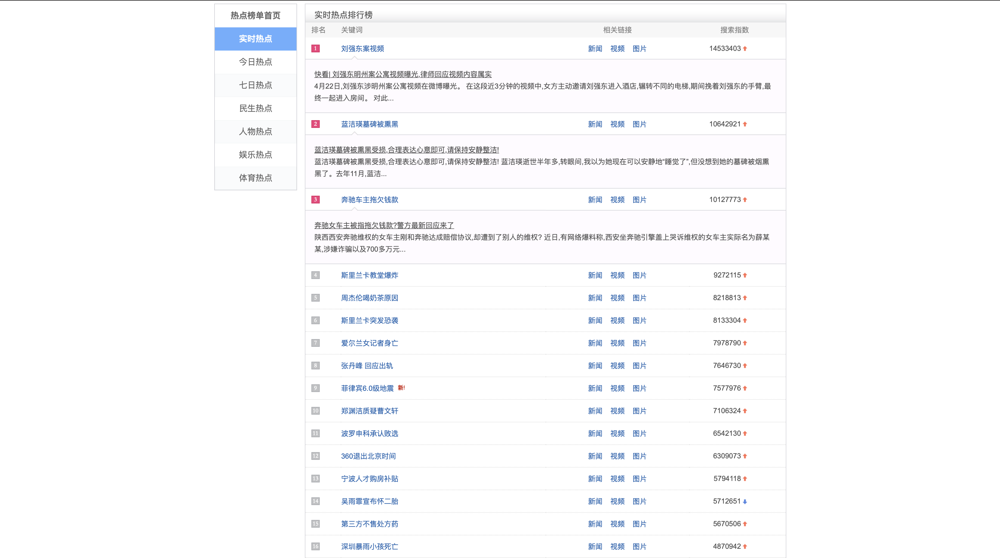

# histroy hot event base

history hot event projrct ,which concentrate on the dayily hot event covers the time range from 2004 to 2019, 16 years in total，  
从2004年至2019年共16年的每日热点事件项目，  
目标包括构建起从2004年至今共16年的历时热点标题数据库，构建16年历时事件热点知识库。   

# How to run?

```shell
bash run.sh
```

This command will create the environment that needed by the project.  
This project is created on the purposes of easy-on-run.  
If you want to know the details about the preject, just read code.  

# 项目介绍  

热点挖掘是舆情分析中十分重要的内容之一，热点刻画了目前我们所生活的社会发展状况。  
热点从类型上来说，包括热点实体以及热点事件两种，前者主要围绕着热点的实体展开，  
包括热点人物、热点电影、热点电视剧、热点经典等，描述的是人类对某种事物物体的关注程度。  
热点事件则在语义上较热点实体更为丰富，往往包括什么人做了什么事情，引起社会的强烈关注。  
后者的存现载体主要有热点微博，热点新闻等。  

从热点的任务角度上来说，热点挖掘包括
热点的表示，  
热点的发现，  
热点的演化追踪  
共三个方面的内容。  

其中，概括性事件表示上，大多使用话题挖掘的方式，使用热点标签词或短语进行热点表示，  
还是停留在一个较为抽象的层级上。  
目前学界关于该热点的任务主要有TDT话题检测语追踪项目以及timeline和storyline的工作，  
其中如何自动挖掘和生成storyline是目前热点挖掘的重点，同时也是难点所在。  
在工业界中，搜索公司百度凭借着搜索入口，在热点的挖掘上有先发优势，  
如每日推出的百度风云榜，以及热点新闻的聚类。  

如图1，百度每日热点风云榜，图2的热点新闻聚类。  

1、百度每日热点风云榜



2、百度热点新闻聚类  

  

就第一张图的效果来看，主要在热点名称的概括上，很像是使用了类似频繁热点短语的方式来确定。  
就第二张图的效果来看，主要涉及到的技术包括热点新闻的聚类技术。  

不过，很遗憾的是，我们只能看到当日的热点，百度并不提供历时的热点查看功能，  
这对于历史热点的发展和挖掘来是个遗憾，  
因此，问题来了，如何来解决这个问题？  
主要有两种方式：  
一种是从今天开始定时抓取每日热点页面并记录到数据库，  
另一种是换一个方式，找具有历时热点的网站自己提取。

第一种方式来源直接，但过去的数据缺失太多，  
第二种方式则获取较为间接，需要依靠算法进行提取，但覆盖面很广。  

比如，新浪新闻给予了从2004年至2019年共16年的语料，这不得不说是一块宝藏，如下图所示：  

  

新浪每日都对热点新闻进行了展示，根据点击量、分享数等进行了热点排序，  
并且按照各类主题(国内、国外、社会、军事)等进行了归类。  
虽然页面中只展示了几条记录，  
但根据后台数据接口，可以获取每日每个主题下前100的新闻数量，  
并且包括新闻的各类信息。  
在采集的过程中发现，新浪新闻进行了多次改版，  
分别是2005年04月02日，2017年12月18日。  
后台上经历了几次变化，有2014年05月09日，2015年04月01日，2017年10月15日都发生了变化。  
通过更改相关的参数，可以应对这些差异。关于这部分的工作可以参考history_hot.py文件。  

因此，本项目的两个目的：  
1、构建起历时热点新闻标题库，年度范围为2004年至2019年。  
2、基于构建起的历时热点新闻标题库，提取每日新闻热点，形成历时热点知识库。  

# 项目脚本

history_hot.py:采集代码  
data/data.json:历时数据，包含了国内新闻和国外新闻标题，从2004年到2019年共16年的新闻标题。  
数据样例为：  
date:新闻日期，topic:新闻类别，分别为guonei_jd和guowai_dj,titles指每日的新闻列表，格式为新闻标题####url:  

{ "_id" : { "$oid" : "5cb88b49831b971bd6bbb0d6" },   
"date" : "20100101", "topic" : "guoji_dj",  
"titles" : [ "解读哥本哈根会议五大争议:体制问题成焦点####http://news.sina.com.cn/w/sd/2009-12-07/160819208146.shtml",
"日本媒体称韩国将与中日协商建海底隧道(图)####http://news.sina.com.cn/w/2009-12-07/074719204903.shtml", 
"英国越狱逃犯网上公布照片挑衅警方(组图)####http://news.sina.com.cn/w/p/2009-12-30/041819364331.shtml", "组图：澳大利亚西部大火烧毁数十栋房屋####http://news.sina.com.cn/w/p/2009-12-31/082419374687.shtml", "法国失踪客机可能是由于电路故障所致####http://news.sina.com.cn/w/2009-06-02/102817934412.shtml", "英国男子狂减300公斤新年获新生####http://news.sina.com.cn/w/2009-12-31/081619374613.shtml", "伊朗欲从哈萨克斯坦进口1350吨提纯铀####http://news.sina.com.cn/w/2009-12-30/095616855283s.shtml", "组图：英国人质在伊拉克被扣押2年半后获释####http://news.sina.com.cn/w/p/2009-12-31/084919374964.shtml", "罗马尼亚性感女部长手握巨额政府资金遭质疑####http://news.sina.com.cn/w/p/2009-12-30/094519367352.shtml", "贝卢斯科尼将用挨揍流血照片做竞选海报####http://news.sina.com.cn/w/2009-12-30/174719370367.shtml", "墨西哥搭建110米高圣诞树创世界纪录####http://news.sina.com.cn/w/2009-12-06/195519201877.shtml", "朝鲜更换货币 兑换比率为1比100(组图)####http://news.sina.com.cn/w/p/2009-12-09/073719220582.shtml", "日本研制出机器蜂鸟可在空中悬停####http://news.sina.com.cn/w/2009-12-30/021319363467.shtml", "波兰称两年后开始从阿富汗撤军####http://news.sina.com.cn/w/2009-12-31/051219372581.shtml", "美国网站公布男模艳照酷似肯尼迪 美媒全部上当####http://news.sina.com.cn/w/2009-12-30/041819364360.shtml", "英国解密档案：撒切尔夫人对威士忌情有独钟####http://news.sina.com.cn/w/2009-12-31/075619374302.shtml", "据称默多克与中国妻子邓文迪分居(图)####http://news.sina.com.cn/w/2009-12-07/021319202357.shtml", "俄罗斯圣彼得堡降下130年来最强暴雪(组图)####http://news.sina.com.cn/w/p/2009-12-30/111819368219.shtml", "印度电视台播放86岁高官性爱录像引发争议####http://news.sina.com.cn/w/2009-12-27/032019345529.shtml", "十年搜索排行榜大事记：印度洋海啸灾难####http://news.sina.com.cn/w/2009-12-24/180719331894.shtml", "伊朗政府号召支持者走上街头向反对派显示力量####http://news.sina.com.cn/w/2009-12-31/093219375375.shtml", "朝鲜货币改革后工人工资增百倍####http://news.sina.com.cn/w/2009-12-30/093519367543.shtml", "苏里南骚乱致25人伤7人失踪####http://news.sina.com.cn/w/2009-12-31/084419374942.shtml", "以色列前核武技术员与外国女友幽会被捕(图)####http://news.sina.com.cn/w/2009-12-30/140319368665.shtml", "韩裔美国男子非法入朝系有意而为####http://news.sina.com.cn/w/2009-12-30/065919365575.shtml", "2009全球十大戏剧性事件盘点:奥巴马伍兹均上榜####http://news.sina.com.cn/w/2009-12-23/125919321727.shtml", "科威特否认本国油轮遭海盗袭击####http://news.sina.com.cn/w/2009-12-31/044619372260.shtml", "2010年新年夜北美及欧洲将出现蓝色月亮(图)####http://news.sina.com.cn/w/2009-12-30/150319369297.shtml", "朝鲜媒体称解决核问题非改善朝韩关系前提####http://news.sina.com.cn/w/2009-12-28/103719352776.shtml",] }  
